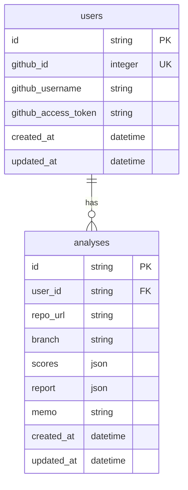

# データベース設計

```mermaid
erDiagram
    users ||--o{ analyses : "has"
    
    users {
        id string PK
        github_id integer UK
        github_username string
        github_access_token string
        created_at datetime
        updated_at datetime
    }
    
    analyses {
        id string PK
        user_id string FK
        repo_url string
        branch string
        scores json
        report json
        memo string
        created_at datetime
        updated_at datetime
    }
```