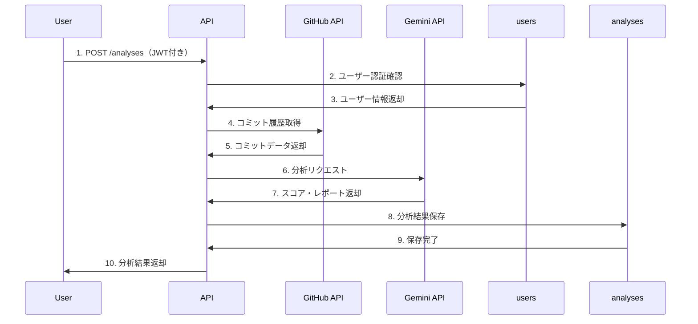

# 分析シーケンス図

```mermaid
sequenceDiagram
    participant U as User
    participant A as API
    participant G as GitHub API
    participant M as Gemini API
    participant users as users
    participant analyses as analyses

    U->>A: 1. POST /analyses（JWT付き）
    A->>users: 2. ユーザー認証確認
    users->>A: 3. ユーザー情報返却
    A->>G: 4. コミット履歴取得
    G->>A: 5. コミットデータ返却
    A->>M: 6. 分析リクエスト
    M->>A: 7. スコア・レポート返却
    A->>analyses: 8. 分析結果保存
    analyses->>A: 9. 保存完了
    A->>U: 10. 分析結果返却
```