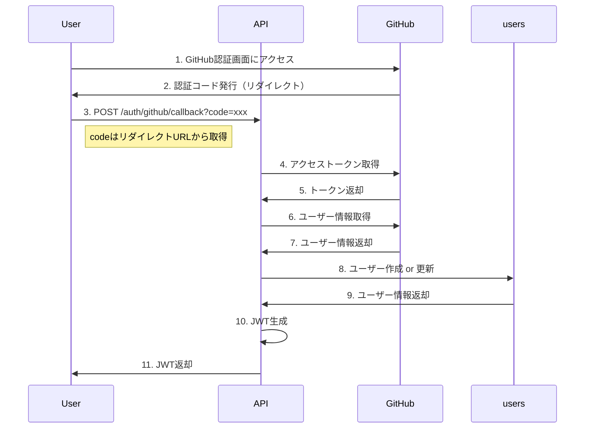

# 認証シーケンス図（GitHub OAuth）

```mermaid
sequenceDiagram
    participant U as User
    participant A as API
    participant G as GitHub
    participant DB as users

    U->>G: 1. GitHub認証画面にアクセス
    G->>U: 2. 認証コード発行（リダイレクト）
    U->>A: 3. POST /auth/github/callback?code=xxx
    Note right of U: codeはリダイレクトURLから取得
    A->>G: 4. アクセストークン取得
    G->>A: 5. トークン返却
    A->>G: 6. ユーザー情報取得
    G->>A: 7. ユーザー情報返却
    A->>DB: 8. ユーザー作成 or 更新
    DB->>A: 9. ユーザー情報返却
    A->>A: 10. JWT生成
    A->>U: 11. JWT返却
```